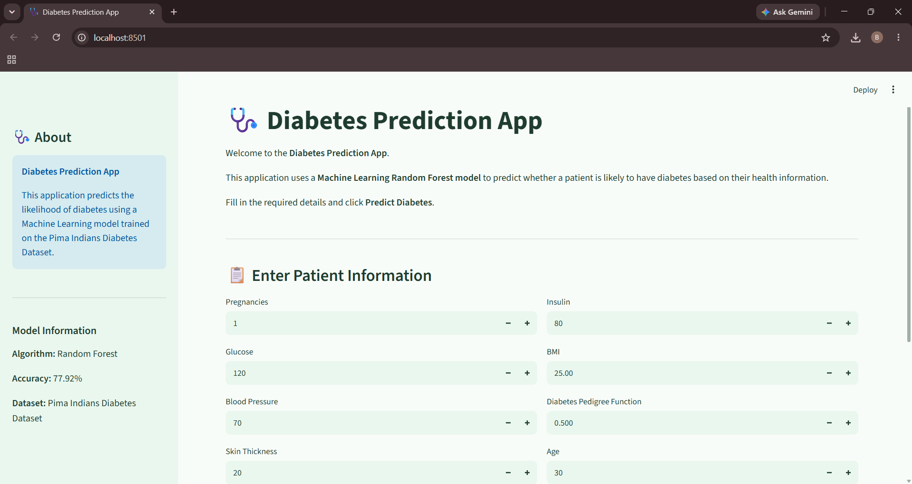
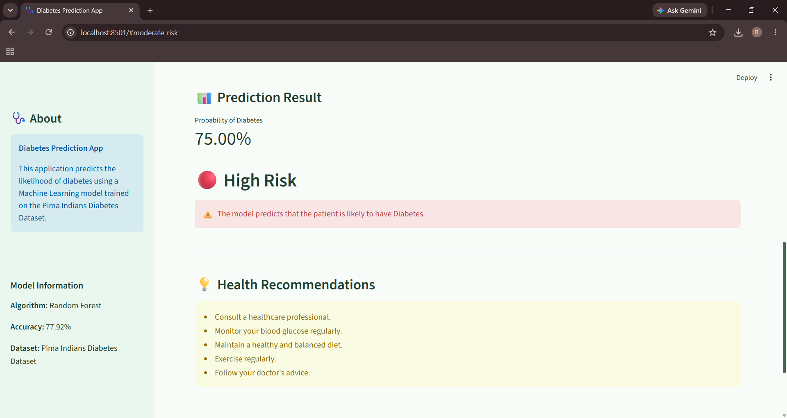
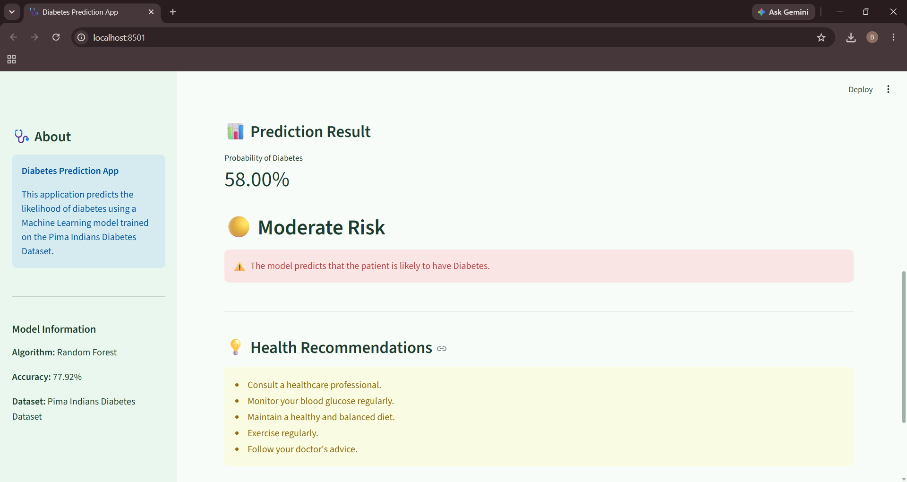
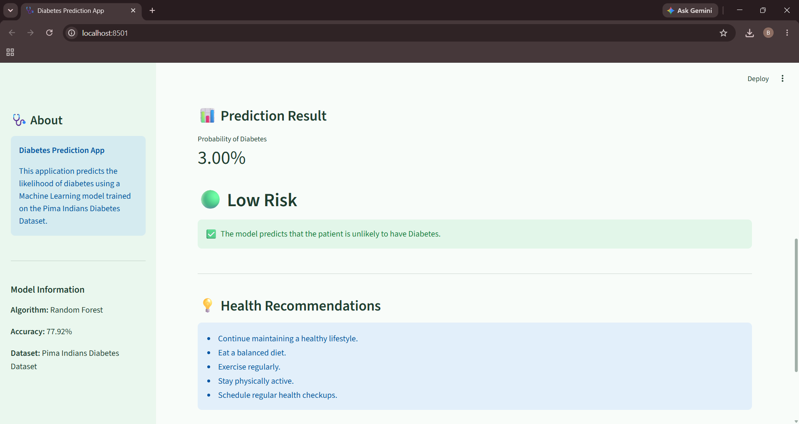

<div align="center">

# 🩺 Diabetes Prediction App

### Predict Diabetes Risk Using Machine Learning & Streamlit

[](https://diabetes-prediction-app-bhoomika.streamlit.app/)


A Machine Learning web application that predicts the likelihood of diabetes based on patient health parameters using a trained **Random Forest Classifier**.

⭐ **If you like this project, don't forget to give it a star!**

</div>

---

# 🌐 Live Demo

🚀 **Try the Application Here**

### https://diabetes-prediction-app-bhoomika.streamlit.app/

---

# 📖 Project Overview

Diabetes is one of the most common chronic diseases worldwide, making early prediction extremely valuable.

This project uses **Machine Learning** to analyze patient health information and predict the likelihood of diabetes.

The application provides an intuitive interface where users can enter health parameters and instantly receive:

- Diabetes Prediction
- Prediction Probability
- Risk Level
- Health Recommendations

The project demonstrates the complete Machine Learning lifecycle from **data preprocessing to deployment**.

> **Disclaimer:** This application is intended for educational purposes only and should not be considered a substitute for professional medical advice.

---

# ✨ Features

✅ Interactive Streamlit Web Application

✅ Clean & Responsive User Interface

✅ Random Forest Machine Learning Model

✅ Prediction Probability

✅ Low / Moderate / High Risk Classification

✅ Personalized Health Recommendations

✅ Data Preprocessing & Feature Scaling

✅ Real-time Prediction

✅ Fully Deployed on Streamlit Cloud

---

# 📸 Application Screenshots

## 🏠 Home Page

> Replace with your screenshot

```markdown

```

---

## 📊 Prediction Result

```markdown

```

---

## 📈 Moderate Risk Prediction

```markdown

```

---

## ✅ Low Risk Prediction

```markdown

```

---

# 📂 Project Structure

```text
Diabetes-Prediction-App
│
├── .streamlit/
│   └── config.toml
│
├── data/
│   └── diabetes.csv
│
├── images/
│   ├── app_home.png
│   ├── prediction_positive.png
│   ├── prediction_negative.png
│   ├── prediction_moderate.png
│   └── correlation_heatmap.png
│
├── models/
│   ├── random_forest_model.pkl
│   └── scaler.pkl
│
├── notebooks/
│   └── diabetes_eda.ipynb
│
├── app.py
├── train_model.py
├── requirements.txt
├── README.md
└── .gitignore
```

---

# 📊 Dataset

**Dataset:** Pima Indians Diabetes Dataset

| Information | Value |
|-------------|------:|
| Records | 768 |
| Features | 8 |
| Target | Outcome |

### Input Features

- Pregnancies
- Glucose
- Blood Pressure
- Skin Thickness
- Insulin
- BMI
- Diabetes Pedigree Function
- Age

---

# 🤖 Machine Learning Models Evaluated

Five different classification algorithms were trained and evaluated.

| Model | Accuracy |
|--------|----------|
| 🥇 Random Forest | **77.92%** |
| 🥈 K-Nearest Neighbors | 75.32% |
| 🥉 Support Vector Machine | 74.03% |
| Logistic Regression | 70.78% |
| Decision Tree | 68.18% |

**Selected Model:** Random Forest Classifier

---

# ⚙️ Tech Stack

| Category | Technology |
|-----------|------------|
| Language | Python |
| Machine Learning | Scikit-Learn |
| Data Analysis | Pandas, NumPy |
| Visualization | Matplotlib |
| Web Framework | Streamlit |
| Model Serialization | Joblib |
| Notebook | Jupyter |
| Version Control | Git & GitHub |

---

# 🔄 Machine Learning Workflow

```text
                 Diabetes Dataset
                         │
                         ▼
                Data Cleaning
                         │
                         ▼
           Exploratory Data Analysis
                         │
                         ▼
              Missing Value Handling
                         │
                         ▼
                 Feature Scaling
                         │
                         ▼
              Train ML Algorithms
                         │
                         ▼
             Model Evaluation
                         │
                         ▼
          Select Best Performing Model
                         │
                         ▼
              Save Model with Joblib
                         │
                         ▼
            Develop Streamlit App
                         │
                         ▼
           Deploy on Streamlit Cloud
```

---

# 🚀 Installation

### Clone the Repository

```bash
git clone https://github.com/Bhoomikapatle412/Diabetes-Prediction-App.git
```

### Navigate to Project

```bash
cd Diabetes-Prediction-App
```

### Install Dependencies

```bash
pip install -r requirements.txt
```

### Run the Application

```bash
streamlit run app.py
```

---

# 📈 Model Output

The application predicts:

- Diabetes Status
- Prediction Probability
- Risk Level
- Health Recommendations

---

# 🔮 Future Improvements

- User Authentication
- PDF Report Generation
- Explainable AI (SHAP)
- Cloud Database Integration
- Mobile-Friendly Design
- Dark Theme
- Multi-language Support

---

# 🤝 Contributing

Contributions are welcome!

If you'd like to improve this project:

1. Fork the repository
2. Create a feature branch
3. Commit your changes
4. Push to your branch
5. Open a Pull Request

---

# 👩‍💻 Author

## Bhoomika Patle

📧 Aspiring Data Scientist & Machine Learning Enthusiast

### GitHub

https://github.com/Bhoomikapatle412

---

# ⭐ Support

If you found this project helpful,

⭐ **Please consider starring this repository!**

It helps others discover the project and motivates future improvements.

---

# 📄 License

This project is licensed under the MIT License.

---

<div align="center">

### ❤️ Built with Python, Scikit-Learn & Streamlit

</div>
